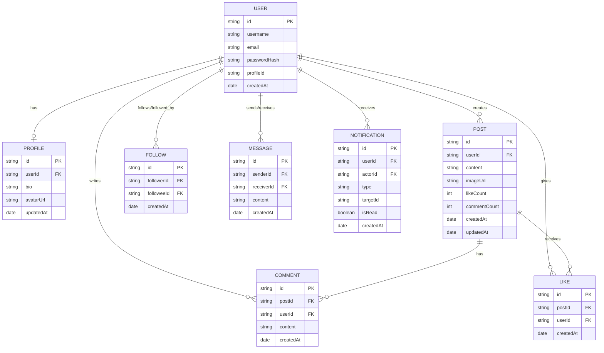
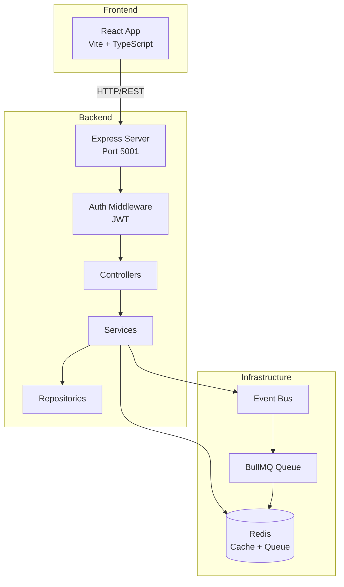
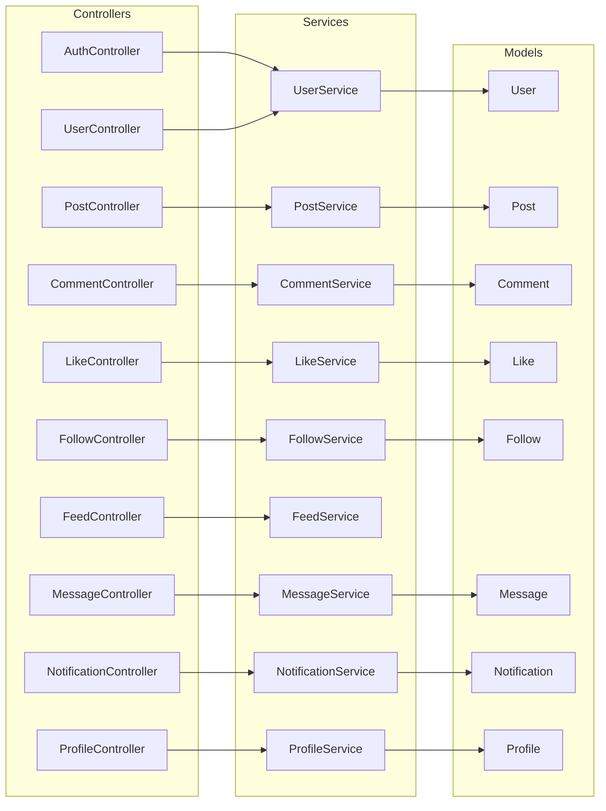
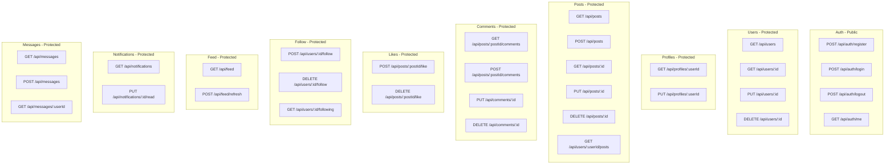
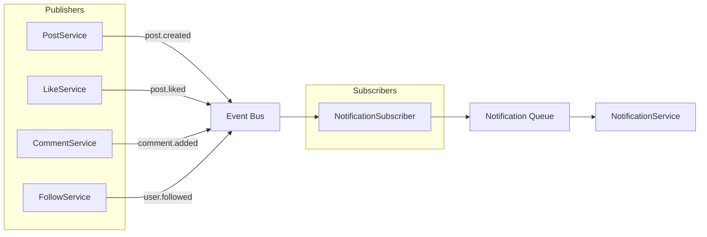
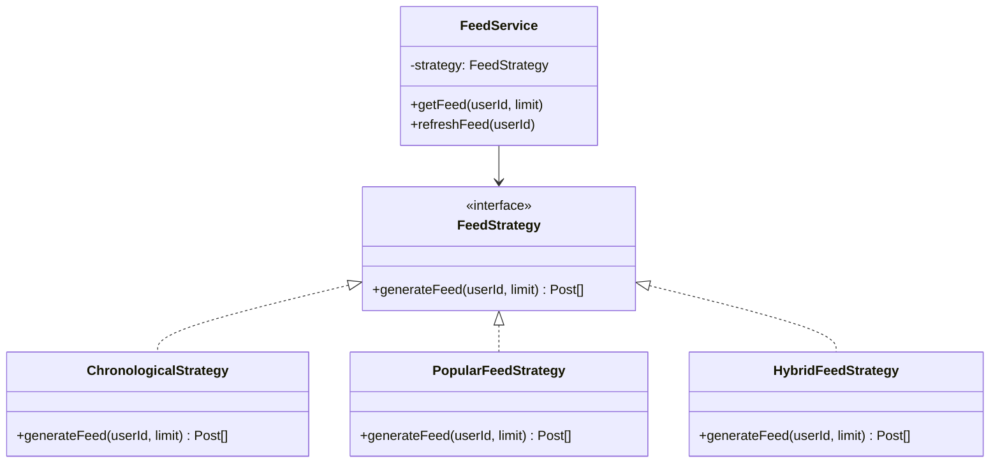

# MeetO - Architecture Diagrams

## 1. ER Diagram

## 2. Use Case Diagram

```mermaid
graph TB
    USER((User))
    
    subgraph "Authentication"
        REGISTER[Register]
        LOGIN[Login]
        LOGOUT[Logout]
    end
    
    subgraph "Profile"
        VIEW_PROFILE[View Profile]
        UPDATE_PROFILE[Update Profile]
    end
    
    subgraph "Posts"
        CREATE_POST[Create Post]
        VIEW_POST[View Post]
        EDIT_POST[Edit Post]
        DELETE_POST[Delete Post]
    end
    
    subgraph "Interactions"
        LIKE_POST[Like Post]
        UNLIKE_POST[Unlike Post]
        ADD_COMMENT[Add Comment]
        EDIT_COMMENT[Edit Comment]
        DELETE_COMMENT[Delete Comment]
    end
    
    subgraph "Social"
        FOLLOW_USER[Follow User]
        UNFOLLOW_USER[Unfollow User]
        VIEW_FEED[View Feed]
    end
    
    subgraph "Messaging"
        SEND_MESSAGE[Send Message]
        VIEW_MESSAGES[View Messages]
    end
    
    subgraph "Notifications"
        VIEW_NOTIFICATIONS[View Notifications]
        MARK_READ[Mark as Read]
    end
    
    USER --> REGISTER
    USER --> LOGIN
    USER --> LOGOUT
    USER --> VIEW_PROFILE
    USER --> UPDATE_PROFILE
    USER --> CREATE_POST
    USER --> VIEW_POST
    USER --> EDIT_POST
    USER --> DELETE_POST
    USER --> LIKE_POST
    USER --> UNLIKE_POST
    USER --> ADD_COMMENT
    USER --> EDIT_COMMENT
    USER --> DELETE_COMMENT
    USER --> FOLLOW_USER
    USER --> UNFOLLOW_USER
    USER --> VIEW_FEED
    USER --> SEND_MESSAGE
    USER --> VIEW_MESSAGES
    USER --> VIEW_NOTIFICATIONS
    USER --> MARK_READ
```

## 3. System Architecture

## 4. Backend Architecture

## 5. API Endpoints

## 6. Event-Driven Architecture

## 7. Feed Strategy Pattern

---

## Features Implemented

### Authentication
- User Registration
- User Login
- JWT Token Authentication
- Logout

### Profile Management
- View User Profile
- Update Profile (bio, avatar)
- Update Account Details

### Posts
- Create Post (with image)
- View All Posts
- View Single Post
- Edit Post
- Delete Post
- View User's Posts

### Social Interactions
- Like/Unlike Post
- Add Comment
- Edit Comment
- Delete Comment
- Follow/Unfollow User
- Check Following Status

### Feed
- Personalized Feed Generation
- Multiple Feed Strategies (Chronological, Popular, Hybrid)
- Refresh Feed

### Notifications
- Like Notifications
- Comment Notifications
- Follow Notifications
- Mark as Read

### Messaging
- Send Direct Message
- View Conversation
- View Chat Partners

### Infrastructure
- Event-Driven Architecture
- Background Job Queue (BullMQ)
- Redis Caching
- Rate Limiting
- Error Handling
- Request Logging

---

## Tech Stack

**Frontend:** React 19, TypeScript, Vite, React Router, Axios

**Backend:** Node.js, Express 5, TypeScript

**Database:** In-Memory (Models)

**Cache & Queue:** Redis, ioredis, BullMQ

**Auth:** JWT, bcryptjs
